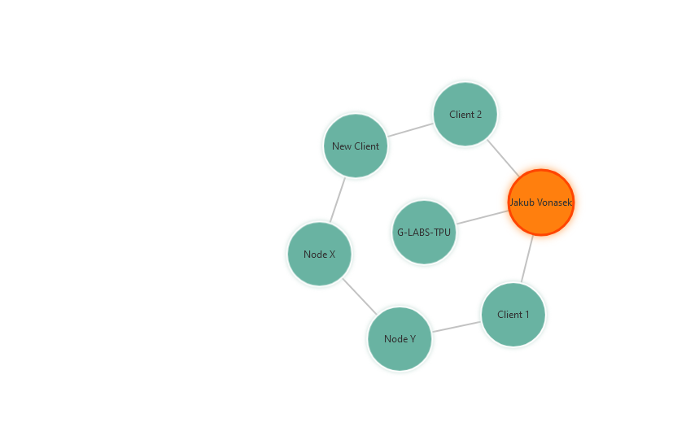

# Network Visualizer

A web-based network visualization tool for displaying and analyzing network structures.



## Features
- Interactive graph visualization using D3.js
- Dynamic node creation and deletion
- Edge creation by dragging nodes close to each other
- Zoom and pan functionality (inherent in D3.js)
- Draggable nodes with force-directed layout
- Collision detection to prevent node overlap
- Boundary forces to keep nodes within the visible area

## Planned Features
- Search and filter capabilities
- Data import/export
- Advanced node and edge customization
- Performance optimizations for large networks

## Tech Stack
- Frontend: React with TypeScript
- Build Tool: Vite
- Styling: CSS

## Getting Started
1. Ensure you have Node.js and npm installed on your system.
2. Clone this repository:
   ```bash
   git clone https://github.com/G-Labs-TPU/network-visualizer.git
   cd network-visualizer
   ```
3. Install dependencies:
   ```bash
   npm install
   ```
4. Start the development server:
   ```bash
   npm run dev
   ```
5. Open your browser and navigate to `http://localhost:5173` to view the app.

## Project Structure
- `src/`: Source files
  - `App.tsx`: Main application component
  - `styles/`: CSS styles
- `public/`: Static assets
- `index.html`: Entry HTML file
- `vite.config.ts`: Vite configuration
- `tsconfig.json` & `tsconfig.node.json`: TypeScript configuration

## Scripts
- `npm run dev`: Start development server
- `npm run build`: Build for production
- `npm run lint`: Lint the project
- `npm run preview`: Preview production build

## License
MIT License

Copyright (c) 2024 G-Labs-TPU

Permission is hereby granted, free of charge, to any person obtaining a copy
of this software and associated documentation files (the "Software"), to deal
in the Software without restriction, including without limitation the rights
to use, copy, modify, merge, publish, distribute, sublicense, and/or sell
copies of the Software, and to permit persons to whom the Software is
furnished to do so, subject to the following conditions:

The above copyright notice and this permission notice shall be included in all
copies or substantial portions of the Software.

THE SOFTWARE IS PROVIDED "AS IS", WITHOUT WARRANTY OF ANY KIND, EXPRESS OR
IMPLIED, INCLUDING BUT NOT LIMITED TO THE WARRANTIES OF MERCHANTABILITY,
FITNESS FOR A PARTICULAR PURPOSE AND NONINFRINGEMENT. IN NO EVENT SHALL THE
AUTHORS OR COPYRIGHT HOLDERS BE LIABLE FOR ANY CLAIM, DAMAGES OR OTHER
LIABILITY, WHETHER IN AN ACTION OF CONTRACT, TORT OR OTHERWISE, ARISING FROM,
OUT OF OR IN CONNECTION WITH THE SOFTWARE OR THE USE OR OTHER DEALINGS IN THE
SOFTWARE.

